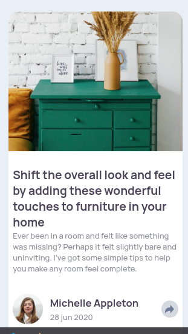

# Frontend Mentor - Article preview component solution

This is a solution to the [Article preview component challenge on Frontend Mentor](https://www.frontendmentor.io/challenges/article-preview-component-dYBN_pYFT). 

## Table of contents

  - [Screenshot](#screenshot)
  - [Links](#links)
  - [My process](#my-process)
  - [Built with](#built-with)
  - [What I learned](#what-i-learned)
  - [Author](#author)


### Screenshot



mobile view 


desktop view

### Links

- Solution: [github repo](https://github.com/William-nyarash/frontend_mentors_javascript.git)
- Live : [Add live site URL here](https://your-live-site-url.com)

## My process
I began by designing  the mobile view then proceeded to the desktop view 

### Built with

- Semantic HTML5 markup
- CSS custom properties
- Flexbox
- CSS Grid
- Mobile-first workflow

### What I learned

how to work with javascript to manipulate the styling 

```js
const toggleSocialLinks = () => {
  if (!shareBtn || !social || !userInfo || !arrowDown) return;

  isVisible = !isVisible;

  if (isVisible) {
    social.classList.add('shared');
    social.style.display = 'flex';
    userInfo.classList.add('hide_from_view');
  } else {
    social.classList.remove('shared');
    social.style.display = 'none';
    userInfo.classList.remove('hide_from_view');
  }
};
```

### Continued development

- stackoverflow
- google
- youtube


## Author

- Frontend Mentor - [@William-nyarash](https://www.frontendmentor.io/profile/william-nyarash)
